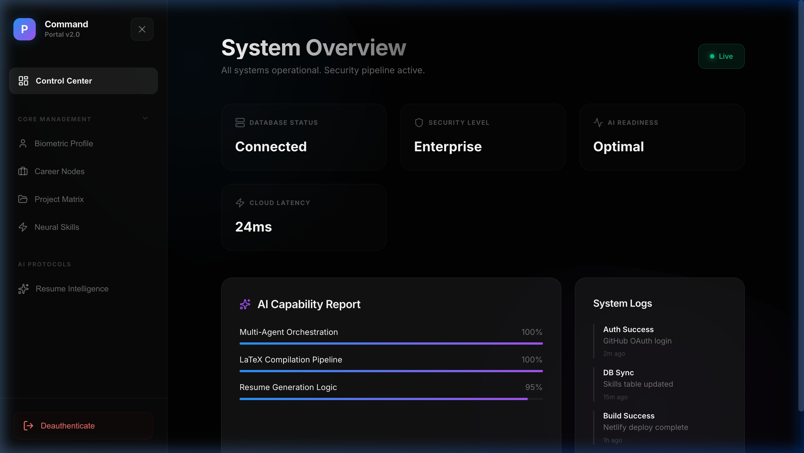
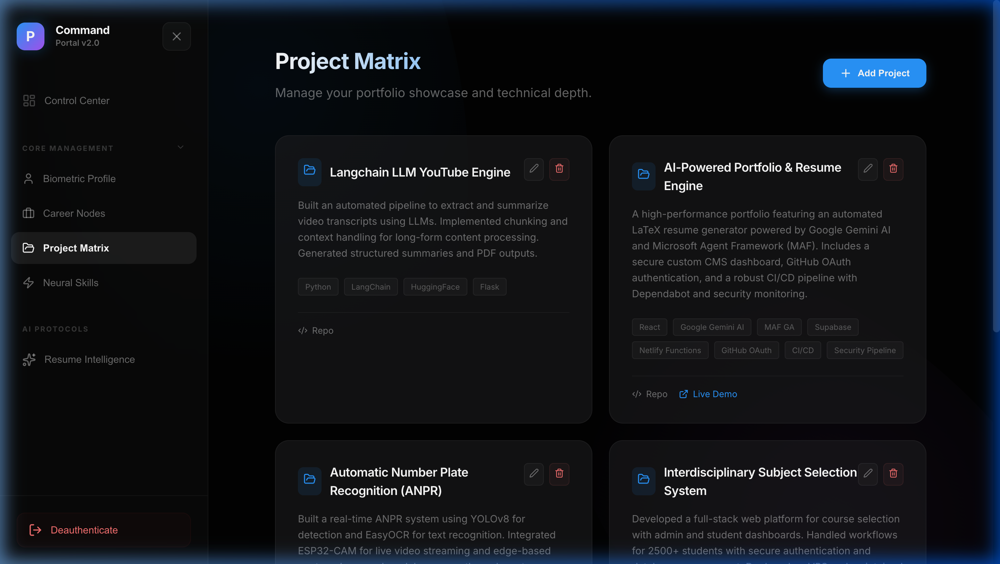
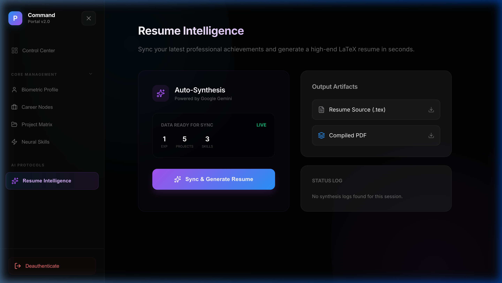

# 🚀 AI-Driven Portfolio CMS & Resume Engine

An enterprise-grade, Apple-inspired portfolio system featuring a real-time Command Center and an automated LaTeX resume pipeline powered by Google Gemini AI.

---

## 📸 System Showcase

### 🛠️ The Command Portal
A high-end administrative interface designed for seamless professional orchestration. Manage projects, experience, and skills with real-time synchronization to the public frontend.



### 📊 Project Matrix
A sophisticated management hub for your technical depth. Map your projects with live status indicators and repository links.



### 🧠 Resume Intelligence
The crown jewel of the system. An automated synthesis pipeline that gathers your latest professional achievements and crafts a perfectly formatted LaTeX resume in seconds.



---

## ⚡ Key Features

- **Dynamic Data Sync**: Zero manual updates. Change something in the CMS, and it reflects instantly on your site and your generated resume.
- **AI Resume Automator**: Leverages **Google Gemini 1.5 Flash** to parse your database and generate ATS-friendly LaTeX documents.
- **Apple-Inspired UX**: Built with **Framer Motion** for organic, fluid animations and a premium glassmorphic aesthetic.
- **Secure Identity**: Protected by **GitHub OAuth** and **Supabase RLS**, ensuring only you hold the keys to your professional data.
- **Enterprise DevOps**: Fully automated **CI/CD via Netlify**, with **Dependabot** security monitoring and GitHub Actions integration.

---

## 🏗️ Technical Architecture

| Layer | Technology | Purpose |
| :--- | :--- | :--- |
| **Frontend** | React + Vite | Reactive UI & Lightning-fast build pipeline |
| **Animation** | Framer Motion | Premium physics-based interactions |
| **Database** | Supabase (Postgres) | Real-time data storage & RLS security |
| **AI Brain** | Google Gemini AI | Dynamic resume synthesis & content generation |
| **Orchestration** | MAF (GA) | Multi-agent framework for complex automation |
| **Infrastructure**| Netlify | Serverless functions & global deployment |

---

## 🚀 Getting Started

### 1. Prerequisites
- Node.js (v18+)
- Supabase Project
- Google Gemini API Key

### 2. Installation
```bash
# Clone the repository
git clone https://github.com/your-username/portfolio-cms.git

# Install dependencies
npm install

# Set up environment variables (.env)
VITE_SUPABASE_URL=your_url
VITE_SUPABASE_ANON_KEY=your_key
GEMINI_API_KEY=your_key
```

### 3. Database Initialization
Run the SQL provided in `supabase_schema.sql` within your Supabase SQL Editor to initialize the tables and RLS policies.

### 4. Development
```bash
npm run dev
```

---

## 🛡️ Security & Reliability
- **GitHub Actions**: Automated testing and deployment.
- **Dependabot**: Proactive dependency vulnerability management.
- **Supabase RLS**: Row-level data isolation.

---

Built with ❤️ for the next generation of engineers.
